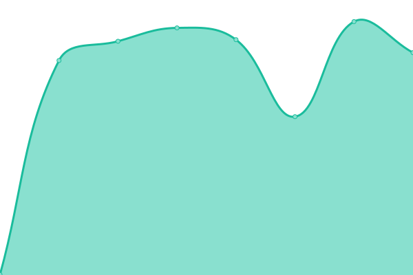
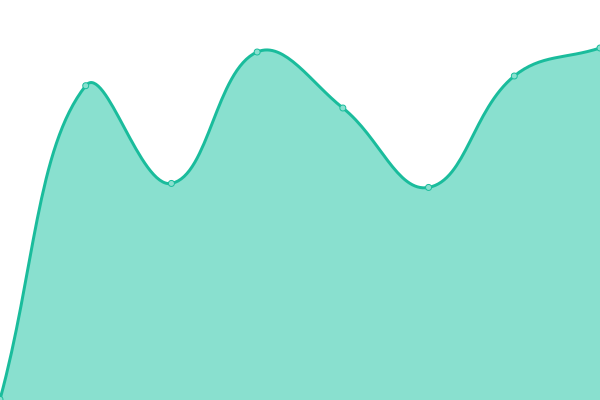

# [📈 Live Status](https://status.slce.moe): <!--live status--> **🟧 Partial outage**

This repository contains the open-source uptime monitor and status page for [Kiso Dev](https://status.slce.moe), powered by [Upptime](https://github.com/upptime/upptime).

With [Upptime](https://upptime.js.org), you can get your own unlimited and free uptime monitor and status page, powered entirely by a GitHub repository. We use [Issues](https://github.com/kisodev/status/issues) as incident reports, [Actions](https://github.com/kisodev/status/actions) as uptime monitors, and [Pages](https://status.slce.moe) for the status page.

<!--start: status pages-->
<!-- This summary is generated by Upptime (https://github.com/upptime/upptime) -->
<!-- Do not edit this manually, your changes will be overwritten -->
<!-- prettier-ignore -->
| URL | Status | History | Response Time | Uptime |
| --- | ------ | ------- | ------------- | ------ |
|  [WitAqua](https://witaqua.org) | 🟩 Up | [wit-aqua.yml](https://github.com/kisodev/status/commits/HEAD/history/wit-aqua.yml) | 

 223ms
     
 | 

<a href="https://status.dev.slce.moe/history/wit-aqua">100.00%</a>
    

|  [WitAqua Download](https://download.witaqua.org) | 🟩 Up | [wit-aqua-download.yml](https://github.com/kisodev/status/commits/HEAD/history/wit-aqua-download.yml) | 

 2343ms
     
 | 

<a href="https://status.dev.slce.moe/history/wit-aqua-download">97.66%</a>
    

|  [WitAqua Wiki](https://wiki.witaqua.org) | 🟩 Up | [wit-aqua-wiki.yml](https://github.com/kisodev/status/commits/HEAD/history/wit-aqua-wiki.yml) | 

 238ms
     
 | 

<a href="https://status.dev.slce.moe/history/wit-aqua-wiki">100.00%</a>
    

|  [WitAqua Gerrit](https://gerrit.witaqua.org) | 🟩 Up | [wit-aqua-gerrit.yml](https://github.com/kisodev/status/commits/HEAD/history/wit-aqua-gerrit.yml) | 

 543ms
     
 | 

<a href="https://status.dev.slce.moe/history/wit-aqua-gerrit">97.67%</a>
    

|  [WitAqua Pasty](https://paste.witaqua.org) | 🟩 Up | [wit-aqua-pasty.yml](https://github.com/kisodev/status/commits/HEAD/history/wit-aqua-pasty.yml) | 

 2489ms
     
 | 

<a href="https://status.dev.slce.moe/history/wit-aqua-pasty">97.67%</a>
    

|  [Kisodev Status](https://status.dev.slce.moe) | 🟥 Down | [kisodev-status.yml](https://github.com/kisodev/status/commits/HEAD/history/kisodev-status.yml) | 

 430ms
     
 | 

<a href="https://status.dev.slce.moe/history/kisodev-status">86.04%</a>
    

<!--end: status pages-->

[**Visit our status website →**](https://status.slce.moe)

## 📄 License

- Powered by: [Upptime](https://github.com/upptime/upptime)
- Code: [MIT](./LICENSE) © [Anand Chowdhary](https://anandchowdhary.com), supported by [Pabio](https://pabio.com)
- Data in the `./history` directory: [Open Database License](https://opendatacommons.org/licenses/odbl/1-0/)
